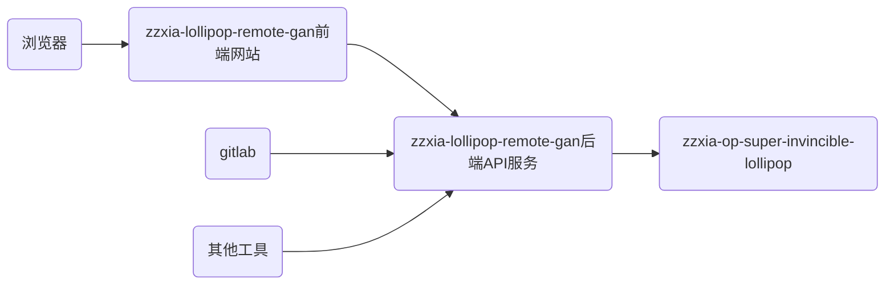

# zzxia-lollipop-remote-gan

中文名：猪猪侠之运维超级无敌棒棒糖API及前端

**如果有使用上的问题或其他，可以在Issues中提出，也可以加wx：`zzxia_ggbond` 解决，加好友时请注明你来自哪个平台！**

[toc]

## 1 介绍

这是`zzxia-op-super-invincible-lollipop`的关联项目，为`zzxia-op-super-invincible-lollipop`提供远程执行的能力，包含后端API服务及前端网站，后端API服务还提供了gitalb类仓库钩子的能力，以实现自动化构建与发布，也可以供第三方工具调用。

### 1.1 背景

`zzxia-op-super-invincible-lollipop`在命令行下运行是非常方便且强大的，但网页端也是很多开发人员喜欢的，另外gitlab也需要他，所以就有了这个项目。

### 1.2 功能

1. 后端API（backend/README.md）：
   - /get/token
   - /hook/gitlab
   - /hook/hand
   - /get/list/project
   - /get/list/docker-cluster-service
   - /get/list/nginx
2. 前端网站（front/README.md）

### 1.3 喜欢她，就满足她：

1. 【Star】她，让她看到你是爱她的；
2. 【Watching】她，时刻感知她的动态；
3. 【Fork】她，为她增加新功能，修Bug，让她更加卡哇伊；
4. 【Issue】她，告诉她有哪些小脾气，她会改的，手动小绵羊；
5. 【打赏】她，为她买jk；

## 2 软件架构

### 2.1 代码语言

- go
- html
- JavaScript

### 2.2 关系图

### 2.3 功能与依赖

需要安装好`zzxia-op-super-invincible-lollipop`项目后才能使用

## 3 安装

项目运行在Linux系统之上，需要与`zzxia-op-super-invincible-lollipop`项目在同一台服务器上。

### 3.1 安装方法

提供两种安装运行方式，一个是在宿主机上作为systemd的服务运行，一个是运行在docker中，具体请参考`deploy/README.md`

注意事项：请根据自己的实际运行环境修改配置文件，后端API服务默认运行在端口9527

## 4 使用

- 后端API服务的调用及gitlab钩子的配置请参考`backend/README.md`

- PC前端（如图）：

- 手机前端（如图）

  

## 5 参与贡献

1.  Fork 本仓库
2.  新建 Feat_xxx 分支
3.  提交代码
4.  新建 Pull Request

